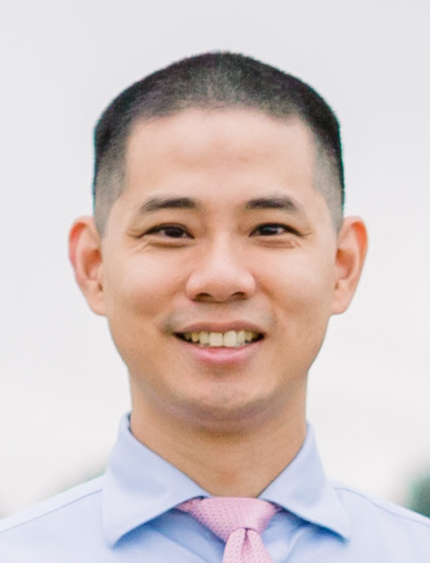
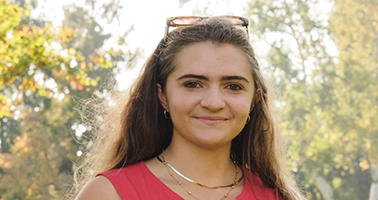

::: {style="max-width: 850px;"}
The SIGNALS Laboratory brings together students and trainees from engineering, medicine,
and computational sciences to work on problems at the intersection of physiology, data,
and clinical care. Mentorship emphasizes both technical development and the ability to
translate quantitative insights into meaningful clinical and scientific questions.
:::

---

## Principal Investigator

::: {.grid}
::: {.g-col-12 .g-col-md-3}
{style="width:100%; border-radius:6px;"}
:::
::: {.g-col-12 .g-col-md-9}
### Joshua T. Chang, MD, PhD
*Assistant Professor of Neurology, Dell Medical School, The University of Texas at Austin*  
*Affiliate Faculty, Oden Institute for Computational Engineering and Sciences*
*Courtesy Assistant Professor, Department of Population Health*

Dr. Joshua T. Chang is a physician–scientist working at the intersection of neurology,
electrical engineering, and computational medicine. He leads the SIGNALS Laboratory at
UT Austin, where his group develops computational approaches to extract clinically
actionable insight from real-world physiological data—including EEG, ECG, voice, and
movement signals—using time-series analysis, machine learning, and mechanistic modeling.
His research focuses on uncovering the dynamical mechanisms underlying cognitive function
and decline, with particular emphasis on aging, early detection of mild cognitive
impairment, and personalized neurostimulation strategies. Broader projects span digital
twin models of physiological systems, gait and balance modeling for fall risk, and
scalable tools for clinical decision support.

Dr. Chang earned his BS and MEng in Electrical Engineering and Computer Science from MIT,
with early work in signal processing and AI at MIT Lincoln Laboratory, the Broad
Institute, and Harvard's Center for Health Decision Science. He completed his MD/PhD in
Quantitative Health Sciences at the University of Massachusetts Medical School, where his
doctoral research under Dr. David Paydarfar focused on adaptive control of neurostimulation
waveforms.
:::
:::

---

## Team Members

::: {.grid}
::: {.g-col-12 .g-col-md-3}
{style="width:100%; border-radius:6px;"}
:::
::: {.g-col-12 .g-col-md-9}
### Sophia Epstein
*PhD Candidate, Oden Institute*

Research focuses on neuromodulation and computational modeling of neural systems, including
stimulation strategies for therapeutic applications.
:::
:::

::: {.grid}
::: {.g-col-12 .g-col-md-3}
{style="width:100%; border-radius:6px;"}
:::
::: {.g-col-12 .g-col-md-9}
### Gabriela Renta Lopez
*PhD Candidate, Biomedical Engineering, UT Austin*

Research focuses on developing dynamic network metrics as biomarkers for cognitive reserve
using EEG data.
:::
:::

::: {.grid}
::: {.g-col-12 .g-col-md-3}
{style="width:100%; border-radius:6px;"}
:::
::: {.g-col-12 .g-col-md-9}
### Jilliane Lagus
*PhD Candidate, Speech-Language-Hearing Sciences*

Research focuses on signal processing and machine learning approaches for detecting
swallowing events using physiological audio signals.
:::
:::

::: {.grid}
::: {.g-col-12 .g-col-md-3}
{style="width:100%; border-radius:6px;"}
:::
::: {.g-col-12 .g-col-md-9}
### Polina Lee
*Undergraduate Student*

Research focuses on movement metrics captured from smartphones as a predictor for fall risk.
:::
:::

---

## Selected Alumni

Students and trainees have gone on to careers in medicine, academia, and industry.

- **Ally Richardson** — Data Scientist, Austin, TX
- **Henry Nguyen** — Medical Student, UT San Antonio
- **Anjana Ganesh** — Medical Student, UT Rio Grande Valley
- **Rohan Shah** — Medical Student, UTMB
- **Nitya Rao** — Ophthalmologist, Austin, TX
- **Daniel Paydarfar** — PhD Candidate, Biostatistics, Harvard
- **Alisha Ragatz** — Data Engineer, Dell Medical School
- **Alan Gee** — Applied Machine Learning Scientist, Austin, TX

---

## Clinical and Residency Mentorship

::: {style="max-width: 850px;"}
As Associate Program Director for Quantitative Research in the Neurology Residency
Program, Dr. Chang mentors residents on research and quality improvement projects.
This includes guidance on study design and evaluation, data collection and analysis,
institutional review processes, and translating clinical questions into quantitative
frameworks. Projects span stroke systems of care, health equity, clinical workflow
optimization, and patient outcomes.
:::